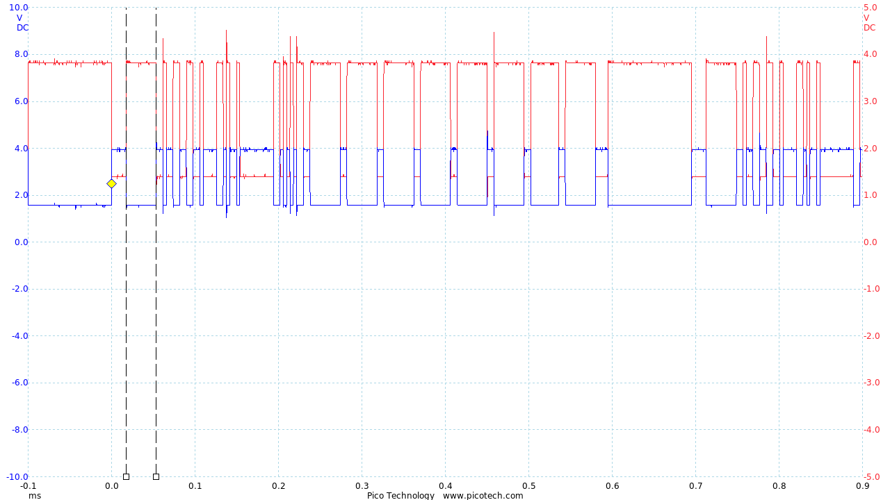
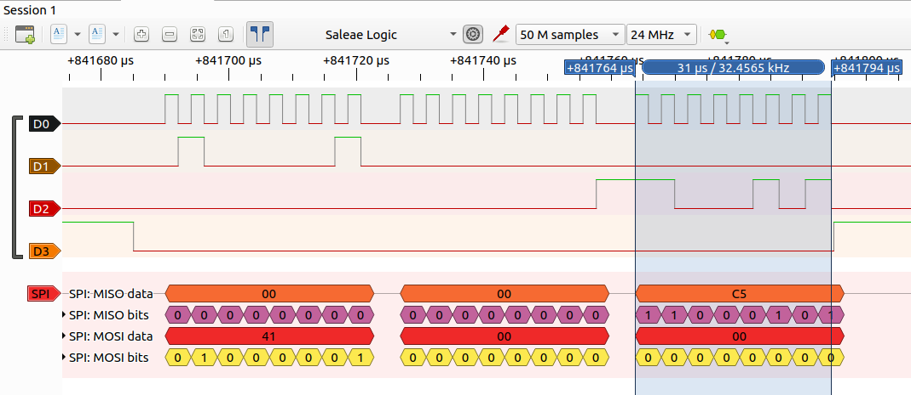

# Analysis

How to find bugs?

## Oscilloscope

Oscilloscopes measure voltages at a high frequency.
An example for a digital oscilloscope is the [PicoScope](https://www.picotech.com/)
which also offers a Linux GUI.

Example of a DMX signal:

## Logic Analysers

Logic Analysers are powerful for digital signals.
[SigRok](https://sigrok.org/) together with PulseView can use 24 MHz logic analysers
which can be obtained for less than 10 dollars on Ebay.

The following image shows PulseView examining SPI communication to an
MCP23S08 port expander.

