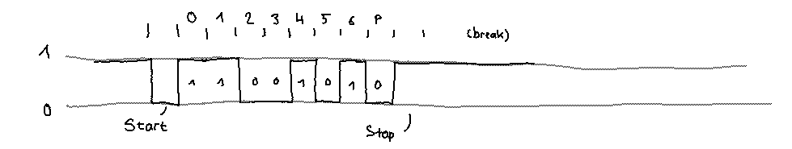

# Microcontrollers

Search “microcontroller common ground disturbances”

* [What could cause a microcontroller to unexpectedly reset?](https://electronics.stackexchange.com/a/81253/135063)
* [Grounding microcontrollers](https://electronics.stackexchange.com/a/286668/135063)
* [Noise Reduction Techniquesfor Microcontroller-Based Systems](https://www.nxp.com/docs/en/application-note/AN1705.pdf)

# Arduino + ATtiny

Programming: [Arduino reference](https://www.arduino.cc/reference/en/)

When programming an arduino, briefly press the Reset button right when clicking
the “upload” button in the Arduino IDE. The reset button runs the bootloader,
which allows a new image to be flashed via USB. If nothing is uploaded within
one second (this behaviour depends on the bootloader which is used), the bootloader
continues and runs the already installed software.

Problems when uploading: [avrdude upload issues][arduino-upload]

[arduino-upload]: https://stackoverflow.com/questions/19765037/arduino-sketch-upload-issue-avrdude-stk500-recv-programmer-is-not-respondi


## IDE configuration

In the settings:

* Enable *Show verbose output during compilation and upload*
* Set *Compiler warnings* to *All*


## Reading PWM signals

* [3 ways to read PWM][3w-pwm]

To read PWM signals: Attach an interrupt to an interrupt pin (advanced mode: to
an interrupt bank) and store `micros()` in a volatile variable.

[3w-pwm]: http://www.benripley.com/diy/arduino/three-ways-to-read-a-pwm-signal-with-arduino/


## Handling millis() overflow

See [Gammon: millis() overflow ... a bad thing?](https://www.gammon.com.au/millis)

Summary: Subtract timestamps, unsigned numbers handle the rest.

```c
unsigned long startTime = millis();
unsigned long interval = 60000;

bool intervalPassed = millis() - startTime >= interval;
```


## Using Arduino as ISP for ATtinys

* [Use Arduino as an ISP programmer to program non-Arduino AVR microcontrollers](https://hardwarefun.com/tutorials/use-arduino-as-an-isp-programmer-to-program-non-arduino-avr-microcontrollers)

Arduino can be used to program e.g. an [ATtiny](https://www.futurlec.com/ICAtmel_ATTiny_Comparison.shtml) model like
ATtiny85, ATtiny84, etc.

1. Upload the *ArduinoISP* to an arduino
2. Wire up the IC (connect SCLK, MISO, MOSI, RESET)
3. Flash the IC (burn bootloader) with fuse bytes to set the clock speed
4. Upload code through the ISP Arduino to the IC


## Serial communication

* [Serial Input Basics](https://forum.arduino.cc/index.php?topic=396450)



Additionally to the built-in serial communications on pins 0 and 1 (also on USB connection), Arduino provides the
[SoftwareSerial](https://www.arduino.cc/en/Reference/softwareSerial) library
for software based serial communication. The RX pins must support interrupts.

UART devices typically use a baud rate of 9600. UART, as well as the serial software library, have a built-in RX and TX
buffer which allows to check if bytes are available for reading – the serial protocol itself does not directly support
this, as only bytes are exchanged on link level.

## Arduino Pro Mini

Can be powered with up to 16 V when supplied through the RAW pin, which is connected
to a [MIC5203](http://ww1.microchip.com/downloads/en/DeviceDoc/mic5203.pdf) voltage regulator
which converts to 3.3 V (or to 5 V, depending on the board version).

**IO pins** supply up to 40 mA each.
Input leakage current is [around 1 µA](https://electronics.stackexchange.com/a/67173/135063),
see also [this SO answer](https://stackoverflow.com/a/18177902/271961). This, if the internal pull-up resistor is not used.
The internal pull-up resistors are [around 20 to 150 kΩ](https://www.arduino.cc/en/Tutorial/DigitalPins).

**Logic Levels** – [Logic Levels](https://learn.sparkfun.com/tutorials/logic-levels)

* 3.3 V version: V<sub>IL</sub> = 0.8 V, V<sub>IH</sub> = 2 V
* 5 V version: V<sub>IL</sub> = 1.5 V, V<sub>IH</sub> = 3 V

Pinout is on the [product page](https://store.arduino.cc/arduino-pro-mini).


## Audio mixing

[Low-Latency Audio](https://wiki.linuxaudio.org/wiki/raspberrypi)
