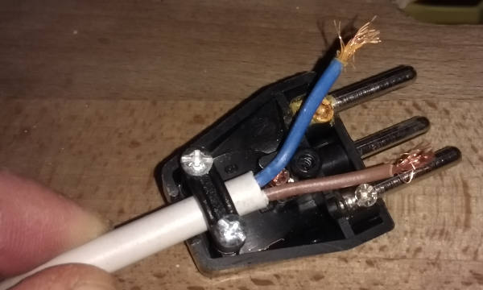

# Electrics and hardware parts

## Plugs

[In Switzerland/EU](https://de.wikipedia.org/wiki/Niederspannungsnetz#Farbgebung), old and new colours

```
N       L
o       o
    o
   PE
```

* **N** *(blue, yellow)* Neutralleiter
* **L** *(brown, black)* Aussenleiter, Phase
* **PE** *(yellow+green, yellow+red)* Schutzleiter, Protective Earth 


## Wires

Rough numbers

    0.75 mm²  15 A
    1    mm²  19 A
    1.5  mm²  24 A

Influence of number of strands on maximum current

     5 → 75 % of the above single-strand value
     7 → 65 %
    10 → 55 %

Copper strand<sup>[1][strombelastbarkeit]</sup>

     0.05 mm²   1 A  30 AWG: Thin flat-band connectors
     0.14 mm²   2 A  26 AWG: Often used in dupont wires
                     24 AWG: Also popular for dupont wires
     0.25 mm²   4 A  23 AWG
     0.34 mm²   6 A
     0.5  mm²  10 A


[strombelastbarkeit]: http://www.linzi.hu/Katalogus/2008-2009/ger/X%20028%20%20Strombelastbarkeit%20(allgemein).pdf


### Making wires more flexible

Besides choosing a wire which *is* more flexible due to thinner strands or silicone coating, wires can also be
wrapped around a fabric core. Some examples on [StackExchange: Wire for harsh environment](https://electronics.stackexchange.com/a/164551/135063)


## Wire Ferrules



Wire ferrules (*Aderendhülsen* in German) are crimped at the end of stranded wire and prevent oxidation and physical 
damage (e.g. by screws) to the strands. A bad example where no wire ferrule was used can be seen in the picture. 


## Switches

Single Pole, Double Pole, Single Throw, Double Throw? See [SPST, SPDT, and DPDT Switches Demystified (pdf)][spst]

[spst]: http://musicfromouterspace.com/analogsynth_new/ELECTRONICS/pdf/switches_demystified_assembly.pdf 
