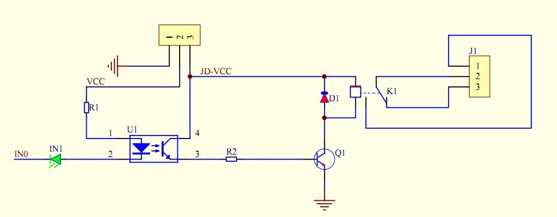
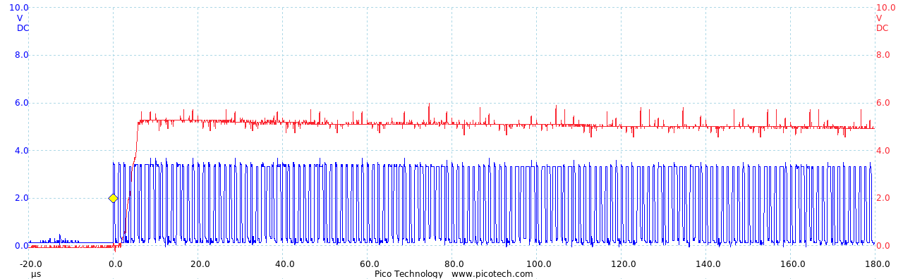

# Electronics

## Good to know

Connector numbering: 1, 2, 3 etc. start on the bottom left, counter-clock wise.
The left side is marked, e.g. with a dot.
([Thanks, js-boxdrawing](http://marklodato.github.io/js-boxdrawing/))

     8 7 6 5
    ┌┴─┴─┴─┴┐
    │o      │
    └┬─┬─┬─┬┘
     1 2 3 4

**DIP** (dual in-line package): ICs with pins for 2.54 mm breadboards. DIP-4 has 4 pins, etc.
The following picture shows a DIP-16 IC, a DIP-4 optocoupler, and another one on a DIP-8 socket.


**SOP**, SOIC, (T)SO… (small outline …): ICs for surface mounting (SMD). The size of the package is given
by a code like 1206, which means 0.12×0.06 inch (imperial code), or 5630, which means 5.6×3.0 mm (metric code).

## Terms

* V<sub>CC</sub>, V<sub>DD</sub>: +, V<sub>SS</sub>, V<sub>EE</sub>, GND: −. More information [on Wikipedia](https://en.wikipedia.org/wiki/IC_power-supply_pin)
* V<sub>F</sub>: Forward Voltage. E.g. voltage drop over diodes, also in optocouplers.
* V<sub>IK</sub>: Input Clamp Current, V<sub>OK</sub>: Output Clamp Current.
  Current which will destroy the IC if the input voltage is out of range.
  See [StackExchange](https://electronics.stackexchange.com/questions/107687/input-and-output-clamping-current-of-the-ic-4082)


## Fuses

protect against overcurrent.

### Normal fuses

* [ESKA: Technische Einführung](http://eska-fuses.de/fileadmin/pdf/content/Technische_Einfuehrung.pdf)

Fuses usually contain a metal wire which melts when the current is too large, hereby interrupting the electrical circuit.
The fuse then has to be replaced.

Fuses blow at different speed. Usually, fast fuses are used for sensitive electronics, and slow fuses are used
if larger currents occur when powering on a device.

### Resettable fuses

* [PolySwitch Fundamentals](Datasheets/S11_PolySwitch-Fundamentals.pdf)

Resettable fuses conduct only when cold. High currents cause it to heat up, and the resistance rasises.
When the current drops, the fuse cools down and conducts again.

Resettable fuses do not need to be replaced after a trip. They are mainly available up to 60 V / 40 A.

Resettable fuses are guaranteed to trip above I<sub>trip</sub>, but not below I<sub>hold</sub>. The trip time depends
on the current; for the PRFA.025, it is 6 ms at 10 A, and 6 s at 1 A.

**PRFA.025**
[(pdf)](Datasheets/Schurter_typ_PFRA.pdf)
—
Series of resettable fuses up to 60 V and 100 A.


## Breadboard prototyping

Some nice breadboard hacks are listed in [My Top Ten Most Useful Breadboard Tips and Tricks][breadboard-tips].

[breadboard-tips]: http://www.instructables.com/id/My-Top-Ten-Most-Useful-Breadboard-Tips-and-Tricks/


## Driving higher loads

To control higher voltages or currents with e.g. a Raspberry 3.3 V 20 mA output, there are different options.

Same voltage:

* Transistor
* MOSFET

Different voltage:

* Optocoupler
* Mechanical relay
* Solid-state relay ([Photo MOSFET](https://www.renesas.com/en-in/products/optoelectronics/technology/difference.html))

The optocoupler output can again be amplified with transistors as they usually have a current of I<sub>C</sub> = 20 mA.
See [Driving High-Level Loads With Optocouplers][vishay-loads].

[vishay-loads]: http://www.soloelectronica.net/PDF/optoacopladores/vishay_driving_high-level_loads_with_optocouplers_83704.pdf

## Useful parts

### Resistors

http://www.resistorguide.com/

### Transistors

Current can flow from collector to emitter if the base voltage V<sub>B</sub> is *more positive* (NPN)
or more negative (PNP) than the emitter voltage V<sub>E</sub>.

There is a voltage drop V<sub>BE</sub> which depends on the transistor. The difference between base and emitter
must in fact be higher than the voltage drop.

A transistor also has a (smaller) voltage drop from collector to emitter, V<sub>CE</sub>, which depends on several variables.
V<sub>CE</sub> also determines losses. A 2N4001 at 500 mA has a V<sub>CE</sub> = 0.75 V, resulting in 375 mW power dissipation.

Transistors work in different modes depending on the voltage levels on each inputs.

* Saturation for V<sub>B</sub> > V<sub>C,E</sub> − acts like a switch. (Again, V<sub>B</sub> > V<sub>E</sub> + V<sub>BE(sat)</sub>)
* Cutoff: No current flows from C to E if V<sub>B</sub> < V<sub>C,E</sub>
* Active: Transistor works as amplifier for V<sub>C</sub> > V<sub>B</sub> > V<sub>E</sub> with I<sub>C</sub> = β I<sub>B</sub>.
  Since I<sub>B</sub> is added to the output current, I<sub>E</sub> is 1/α I<sub>C</sub> for α = β / (β+1).
* Reverse Active: Current flows from E to C if V<sub>C</sub> < V<sub>B</sub> < V<sub>E</sub>. Not how transistors
  should be used; β<sub>R</sub> is lower.

Saturation is when the transistor is fully conductive and increasing the base current I<sub>B</sub> does not change
the output signal any further – or, not significantly.
ON’s data sheet for the 2N4401 contains a nice graph which shows the collector–emitter forward voltage with increasing I<sub>B</sub>.
Note how the curve also depends on I<sub>C</sub>.


Further links:

* [Transistor as Switch](http://www.electronicshub.org/transistor-as-switch/), see also the chapter “Example of NPN Transistor as a Switch”
  about inverting an input signal with a transistor.
* [Bipolar Transistor](http://www.electronics-tutorials.ws/transistor/tran_1.html)

#### Sample Transistors

The following transistors are all in a TO-92 housing with 3 legs. Note that the leg order E–B–C is not standardised,
so it needs to be looked up for each transistor individually in the data sheet.

There are also transistor arrays in DIP housings, like the ULN2802A [(pdf)](http://www.ti.com/lit/ds/symlink/uln2803a.pdf),
which have one common emitter (or collector, for PNP). They are in fact darlington transistor arrays (two transistors in series)
and suit well as switches with a h<sub>fe</sub> of around 1000.

**2N4401**
[(pdf)](Datasheets/2N4401-D.PDF)
—
I<sub>C</sub> 600 mA, V<sub>BE(sat)</sub> 0.75–1.2 V, V<sub>CE(sat)</sub> 400–750 mV

**BC337**
[(pdf)](Datasheets/BC337-D.PDF)
—
I<sub>C</sub> = 800 mA, V<sub>BE(sat)</sub> = 1.2 V, V<sub>CE(sat)</sub> 300–700 mV

**BC547**
[(pdf)](Datasheets/BC547-short.pdf)
—
I<sub>C</sub> = 100 mA, V<sub>BE(sat)</sub> = 0.7–0.9 V, V<sub>CE(sat)</sub> 90–250 mV. Constant h<sub>fe</sub>.

**BC635**
[(pdf)](Datasheets/bc635.pdf)
—
I<sub>C</sub> 1 A, V<sub>BE(sat)</sub> = 1 V, V<sub>CE(sat)</sub> 10–300 mV.

**BC327** *PNP*
[(pdf)](Datasheets/BC327-D.PDF)
—
I<sub>C</sub> −800 mA, V<sub>CE(sat)</sub> −0.7 to −1 V


**BC557** *PNP*
[(pdf)](Datasheets/BC557-short.pdf)
—
I<sub>C</sub> −100 mA, V<sub>CE(sat)</sub> −90 to −250 mV

**2N2907** *PNP*
[(pdf)](Datasheets/2N2907A-D.PDF)
—
I<sub>C</sub> −600 mA, V<sub>BE(sat)</sub> −0.6 to −2.6 V, V<sub>CE(sat)</sub> −70 to −1600 mV


### MOSFETs

are *voltage controlled*, in contrast to bipolar transistors, which are current controlled. This means that when
a current flows between drain and source, a MOSFET requires (almost) no current through the gate.

* In N-channel MOSFETs, current flows if V<sub>G</sub> > V<sub>S</sub>.
* In P-Channel MOSFETs, current flows for V<sub>G</sub> < V<sub>S</sub>.

The load goes to the drain.

MOSFETs can drive ridiculously high currents (like 140 A) in their packings with heatsink like TO-220, TO-262, etc.;
these are called *power MOSFETs*. N-channel power mosfets have lower resistance than P-channels.

To efficiently switch MOSFETs at high load, this must be done quickly due to losses during the transition phase.
This is important especially for power MOSFETs operating at higher frequency. Switching quickly requires *high currents*
to charge/discharge, but only for a short amount of time.

The MOSFET gate is sensitive to electrostatical discharge and it is not too hard to break a MOSFET when not handled carefully;
transistors are much more robust in this regard.


#### Thermal Dissipation

When power is dissipated in a MOSFET, its temperature rises. Thermal resistance describes how much of this thermal power
is “kept back” in different transitions. In MOSFETs, there are transitions from junction/die to case, to heat sink, to ambient –
while ambient usually is still air without ventilation.

Data sheets often provide only a subset of those values. θ<sub>JC</sub> is also written as R<sub>θJC</sub>.


Thermal resistance of junction to case, θ<sub>JC</sub>, and case to sink, θ<sub>CS</sub>, are given by the part’s case.
The transition to ambient can be changed by attaching the heat sink to a better/larger heat sink with a thermal resistance
that is below θ<sub>SA</sub>, or by cooling the part with a fan.

Example values for θ<sub>JA</sub> are 313 °C/W for a 2N700 in a TO-92 package, and 62 °C/W for a IRL3803 in a TO-220AB package.

MOSFETs have a maximum junction temperature T<sub>Jmax</sub>, which is affected by the die quality. Power dissipation has
to be low enough so that its junction temperature stays below the maximum value. For an IRL3803 with T<sub>Jmax</sub> = 175 °C
and T<sub>A</sub> = 25 °C, the maximum power dissipation is `150 °C / 62 °C/W = 2.4 W` with ambient cooling, and with an
appropriate heatsink and a θ<sub>JC</sub> of 0.75 °C/W it is `150 °C / 0.75 °C/W = 200 W`.

```math
P_{Dmax} = \frac{T_{Jmax} - T_A}{\Theta_{JA}}
```

Power dissipation mainly happens due to the on-resistance R<sub>DS(on)</sub> in the continuous case,
and when switching the MOSFET.

Maximum current, however, is not only determined by the maximum defined thermal dissipation, but also by
the maximum continuous drain current I<sub>D</sub> which may be much lower than expected from thermal design.
The reason is that when the thin wire bonds from die to packing (legs/case) are surrounded by a medium with
bad thermal conductance, they heat up much faster and burn – see [Continuous MOSFET drain](https://electronics.stackexchange.com/a/137546/135063)

#### References

* [How do I choose my optocoupler to drive a solenoid with a MOSFET?][bjt-vs-mosfet]
* [P-channel MOSFET][p-channel-mosfet] and power MOSFETs
* [MOSFET Thermal Characterization in the Application](Datasheets/71619_mosfet-thermal-characterization.pdf) (PDF)
* [Understanding Thermal Dissipation and Design of a Heatsink](Datasheets/slva462_understanding-thermal-dissipation.pdf)
* [Thermal Design Basics](http://www.analog.com/media/en/training-seminars/tutorials/MT-093.pdf)


#### Sample MOSFETs

Some TO-92 MOSFETs:

**2N7000**
[(pdf)](Datasheets/2N7000-short.pdf)
—
N-Channel. I<sub>D</sub> 200 mA

**BS170**
[(pdf)](Datasheets/BS170-short.pdf)
—
N-Channel. I<sub>D</sub> 500 mA

Larger MOSFETs; note that their legs do not fit into 2.54 mm PCB holes, but they can be soldered on top of PCBs.

**SiHU5N50D**
[(pdf)](Datasheets/sihu5n50d.pdf)
—
N-Channel. V<sub>DSS</sub> 500 V, R<sub>DS(on)</sub> 1.2 Ω, I<sub>D</sub> 5.3 A

**IRL3103**
[(pdf)](http://www.irf.com/product-info/datasheets/data/irl3103.pdf)
—
N-Channel.
V<sub>DSS</sub> 30 V, R<sub>DS(on)</sub> 12 mΩ, I<sub>D</sub> 64 A

**IRL3803**
[(pdf)](Datasheets/irl3803.pdf)
—
N-Channel.
V<sub>DSS</sub> 30 V, R<sub>DS(on)</sub> 6 mΩ, I<sub>D</sub> 140 A

**IRF5305**
[(pdf)](http://www.irf.com/product-info/datasheets/data/irf5305s.pdf)
—
P-Channel.
V<sub>DSS</sub> −55 V, R<sub>DS(on)</sub> 6 mΩ, I<sub>D</sub> −31 A

**IRF4905**
[(pdf)](http://www.irf.com/product-info/datasheets/data/irf4905s.pdf)
—
P-Channel.
V<sub>DSS</sub> −55 V, R<sub>DS(on)</sub> 20 mΩ, I<sub>D</sub> −74 A

**IRFU9024**
[(pdf)](http://www.vishay.com/docs/91278/sihfr902.pdf)
—
P-Channel.
V<sub>DSS</sub> −60 V, R<sub>DS(on)</sub> 280 mΩ, I<sub>D</sub> −8.8 A


[bjt-vs-mosfet]: https://electronics.stackexchange.com/a/43073/135063
[p-channel-mosfet]: http://www.sprut.de/electronic/switch/pkanal/pkanal.html


### Diodes

are conductive in one direction.
Normal diodes have a forward voltage V<sub>f</sub> of around 0.7 V, which increases with higher currents and lower temperatures.
Schottky and Germanium diodes have smaller forward voltages around V<sub>f</sub> = 0.3 V.


**1N4001** up to **1N4007**
[(pdf)](Datasheets/1n4001.pdf)
—
Rectifier diode, 50 to 1000 V, 1 W.
Forward voltage (voltage drop) is V<sub>F</sub> = 0.75 V @ 0.1 A and 1.1 V @ 1 A.

**1N5817** to **1N5819**
[(pdf)](Datasheets/1N5817-D.PDF)
—
Schottky barrier rectifier diode. V<sub>F</sub> = 0.32 V @ 0.1 A and 0.45 V @ 1 A.


### Zener Diodes, Z Diodes

are used for overvoltage protection. Unlike normal diodes, they are mainly operated in reverse direction where the
breakdown voltage U<sub>BR</sub> is well-defined. Above this voltage, the diode conducts with a voltage drop of U<sub>BR</sub>.

A voltage of 3.3 V can therefore be maintained by a 3.3 V Zener diode.


### Varistors

are *variable resistors* whose resistance depends on the voltage. Above a certain voltage (like 30 V or 250 V),
resistance drops and the varistor conducts.

Compared to Zener diodes, varistors are less precise. They are also used for high voltage to e.g. protect against
lightning strikes where high voltages occur for a very short time.


## Relays

Relays switch a contact by magnetic force, allowing a small voltage to control e.g. 220 V.

Since relays are mechanical switches, their switching speed is limited to e.g. 10 per second, and they also have
an expected life time both mechanically (switch breaks, e.g.) and electrically (switch burns due to sparks on contact).

Operating relays requires a certain amount of power. *Relay modules* operate the relay by amplifying the input signal,
and they often provide galvanic separation between signal and relay power.

**2-channel 5 V Songle Relay Module with Optocoupler**
[(pdf)](Datasheets/SRD-05VDC-SL-C-Datasheet.pdf)
—
Common 5 V relay module which is often used with Arduinos, Raspis, etc., easily available.
10 A 250 V, life expectation 10⁵ (el.) / 10⁷ (mech.) operations for 1 op/second.

The relay is not operated directly; it can/should be powered by a second source (JD-VCC) which is galvanically
separated from the input signal. In this relay, a small input signal drives an optocoupler, which itself drives
the relay with a transistor.

Powering it with 3.3 V from a Raspberry *often* works when connecting VCC and JD-VCC.
If the current is not high enough (e.g. 16 mA from the Raspi), the LED IN1 will be on, but nothing happens.
Since relays are mechanical switches, it is often possible to trigger the switch by flicking against the relay,
which is naturally not a long term solution but a fun fact.

More reliable is to use separate 5 V for JD-VCC. The relay switches when IN0 is *low.*




## Useful ICs

### I²C

is a common protocol for sending data over two wires (common ground is required too).
It is supported by many devices like ICs, Raspberry, Arduinos, etc.

**PCF8574P** and **PCF8574AP** —
[(pdf)](Datasheets/PCF8574.pdf)
I²C based port expander. Connect SDA (data) and SCL (clock) to the Raspi I²C pins (5 and 7) for 8 additional digital IOs.

Both ICs have 3 address bits/pins, so 8 of them can be used. The P and AP differ only in their
slave address, so when used together, 16 of them can be attached (resulting in 128 IOs).

The IOs are quasi-bidirectional. An IO is either configured LOW, in which case it functions as open drain (“output”) to GND.
When configured HIGH, a 100 µA current source to V<sub>DD</sub> is active and the IO functions as input.

**MCP23008** and **MCP23017**
(PDF: [23008](Datasheets/MCP23008_21919e.pdf),
[23017](Datasheets/MCP23017_20001952C.pdf))
—
I²C based port expander, also available as SPI version. MCP23008 has 8 ports in DIP-18, and MCP23017 has 16 ports in DIP-28.

IOs can be configured individually as input or output. Outputs can source/sink 25 mA each (i.e. both when HIGH or LOW).
They have internal pull-up resistors which can be enabled.
Note that the ¬RST pin needs to be connected to V<sub>DD</sub> unless it needs resetting.

The MCP23017 ports are divided into the two banks A (ports 0–7) and B (ports 8–15) which are addressed separately.
Addressing of registers can be changed by setting IOCON.BANK, which defaults to 0 (GPIO addresses are on 0x12 and 0x13).

The [MCP23016](Datasheets/MCP23016_20090C.pdf) is deprecated.

See also:

* [Tutorial: Why use MCP23008 / MCP23016 / MCP23017 expanders][mcpxx-tut]
* [How to get pin addresses on a MCP23017][mcp23017-banks] (StackExchange)

[mcpxx-tut]: http://peter224722.blogspot.ch/2014/03/why-use-mcp23008-mcp23016-mcp23017.html
[mcp23017-banks]: https://raspberrypi.stackexchange.com/questions/7205/how-to-get-pin-addresses-on-a-mcp23017

### Optocouplers

drive higher voltages with a lower-voltage input signal. For example, control a 24 V LED button with a 3.3 V signal.

Optocouplers separates two voltages (galvanic isolation) by driving a phototransistor with an infrared LED.
So, in addition to amplifying a signal, the output voltage can also be at a completely different level.

The CTR (Current Transmission Ratio) of an optocoupler is defined as I<sub>C</sub>/I<sub>F</sub>. For a CTR of 100 %,
a forward current of 20 mA through the LED will allow a collector current of 20 mA through the phototransistor.

The LED inside optocopulers decreases over time, and more quickly at high temperatures.

References:

* [How to Use Optocoupler Normalized Curves](Datasheets/Howto-Optocoupler-normalized-curves_83706.pdf)

**PC817**
[(pdf)](Datasheets/PC817C.pdf)
—
DIP-4, CTR 50–140 %.
Max 3 V 50 mA in, 35 V 50 mA 150 mW out. Rise/fall times t<sub>r</sub>, t<sub>f</sub> = 4–18 µs.

Easily available and cheap.

**4N25**
[(pdf)](Datasheets/4n25.pdf)
—
DIP-6. CTR 20–50 %. Rise/fall times t<sub>r</sub>, t<sub>f</sub> = 2 µs.
The phototransistor base is accessible (must be connected) and can be used e.g. to switch off faster;
see [Optocoupler with phototransistor base lead][optocoupler-base-pin].

**4N35**
[(pdf)](https://www.vishay.com/docs/81181/4n35.pdf)
—
Like the 4N25, but with a CTR > 100 %.

**ILD2**, **ILQ2**
[(pdf)](http://www.vishay.com/docs/83646/ild1.pdf)
—
Dual/quad channel optocouplers, DIP-8 and DIP-16.

**617** — More optocouplers

[optocoupler-base-pin]: https://electronics.stackexchange.com/questions/48462/optocoupler-with-phototransistor-base-lead

### Op-Amps

are transitor based circuits. An op-amp also amplifies the signal, but with additional benefits like a temperature
independent, and generally higher, h<sub>fe</sub>. Ideally, they have infinite input inpedance, i.e. they are
voltage controlled. In reality, a small *input bias current* I<sub>IB</sub> does flow.
The NE5532, for example, has an I<sub>IB</sub> of 1 µA.

References:

* [Op Amp Input Bias Current][opamp-bias-current-pdf]
* [Op Amp Input Bias Current][opamp-bias-current]

**NE5532**
[(pdf)](http://www.ti.com/lit/ds/symlink/ne5532.pdf)

[opamp-bias-current-pdf]: http://www.analog.com/media/en/training-seminars/tutorials/MT-038.pdf
[opamp-bias-current]: http://ecircuitcenter.com/Circuits/op_ibias/op_ibias.htm


### Comparators

**LM393** —
[(pdf)](Datasheets/lm393-n.pdf)
Comparator; compares two voltages and sets the output low or high, depending on which input was higher.

### Counters

**NE555** — Decade counter.

**CD4017B** — Decade counter, 10 inputs

### Logic operators

**74HCT08** —
3 V to 5 V level shifter. Actually only an AND, but with V<sub>DD</sub> = 5 V and V<sub>IH</sub> = 2 V it can be used
to shift 3.3 V from the Raspi (or from elsewhere) to a 5 V signal.

Compared to optocouplers, the 74xx are much more efficient with I<sub>I</sub> = 1 µA as there is no need to power a LED,
but V<sub>CC</sub> is only 4.5 to 5.5 V.

Also, their response time is a lot shorter; around 40 ns compared to 20 µs for a PC817.

[The 74xx Series](https://www.mikrocontroller.net/articles/74xx) contains many logic chips. Some data sheets:
* [SN74HCT00 (pdf)](Datasheets/sn74hct00-short.pdf) is a 2-input NAND (25 ns max.; 9 ns max. for AHCT version)
* [SN74HCT08 (pdf)](Datasheets/sn74hct08-short.pdf) is a 2-input AND (30 ns max.; 9 ns max. for AHCT version)
* [SN74AHC125 (pdf)](Datasheets/sn74ahct125-short.pdf) is a fast 3-state buffer (10 ns max.)

## Voltage Regulators

**LM3940** —
[(pdf)](Datasheets/lm3940.pdf) Converts 5 V to 3.3 V. Basically by means of converting electrical to thermal energy.
3.3 V, 1 A; U<sub>in</sub> 4.5 to 5.5 V.

## Toys

### Dot-Matrix LCD displays

LCD Displays with pixels, also available with backlight.

**HD44780**
controls dot matrix LCD displays. It requires 6 IOs.

### 7-Segment LCD/LED displays

    ╷╷ ╶┐
    └┤ ┌┘
     ╵ └╴
Typically, each segment of those displays is enabled with a separate input. One element therefore requires 8 pins
(7 segments + GND or V<sub>CC</sub>).

Displays with more (e.g. 4) elements reduce the number of pins by adding *element enable pins.* Only one element
is active simultaneously, but when switching the active element fast enough, it appears to the eye as if all elements
were active. 7-segment displays [can easily be controlled by a Raspberry][7-segment-pi].

**MAX7219**
controls 8 elements and uses 2 inputs, clock and data.

**SBA32-11EGWA**
[(pdf)](Datasheets/Kingbright-SBA32-11EGWA.pdf) is a large segment display with red *and* green (and, together, orange).


### LEDs

**WS2812B** —
[(pdf)](Datasheets/28085-WS2812B-RGB-LED-Datasheet.pdf)
RGB LED with integrated chip (or the other way round), PWM controlled. Usually on LED stripes which can be cut off anywhere.
LEDs take 60 mA when all 3 colours are on, V<sub>DD</sub> = 5 V. Data (D<sub>IN</sub> and D<sub>OUT</sub> PINs) have
logic levels 0.3 V<sub>DD</sub> and 0.7 V<sub>DD</sub> and require 1 µA.
WS2812B is the [improved version of the WS2812](https://acrobotic.com/datasheets/WS2812B_VS_WS2812.pdf).

Since the signals sent on the data pin are around 400 ns, it is not possible to use optocopulers for shifting a 3.3 V
signal to 5 V. They have a response time of several 1000 ns. A 74HCT08 can instead be used.

The following image shows the same WS2812B signal directly from the Raspi (blue) and after an optocoupler (red).
Quite obviously, it is not quite the same curve. The PC817 is too slow to reproduce the signal



After the faster SN74HCT08, the signal is reproduced almost identically, but at a level of 5 V.


To get it working on a Raspi directly, use [rpi-ws281x-native](https://www.npmjs.com/package/rpi-ws281x-native).
Level shifting to 5 V is required, otherwise artifacts (wrong pixels) will occur.
This method is very fast and writes about 24000 LEDs per second on a 60 LED strip (400 fps).

Another solution is to feed colour data from the Raspi to an Arduino. Arduino’s microcontroller then sends data to  WS2812.
Use [node-pixel][pixel] and flash the Arduino (I use an Arduino Pro Mini) [with the Backpack firmware][pixel-backpack];
it then listens on I²C on pins A4 and A5, which may have to be soldered first.
On the Raspi, connect to the Arduino with Johnny-Five [and raspi-io][pixel-raspi-io].
This method is slower with around 740 LEDs per second, which is 12 fps for 60 LEDs.


[7-segment-pi]: http://raspi.tv/2015/how-to-drive-a-7-segment-display-directly-on-raspberry-pi-in-python
[pixel]: https://www.npmjs.com/package/node-pixel
[pixel-backpack]: https://github.com/ajfisher/node-pixel/blob/master/docs/installation.md#i2c-backpack-installation
[pixel-raspi-io]: https://github.com/ajfisher/node-pixel/issues/68#issuecomment-232822499


## EL Wire

* [How to solder or repair EL wire](http://elwirecraft.co.uk/el-how-to-and-tips/how-to-solder-or-repair-el-wire/)
* [The Full "How To" Manual for EL (Electroluminescent) Wire](http://www.instructables.com/id/The-Full-How-Too-Manual-For-EL-Electroluminesce/) (See comment by MTJimL)


## Random links

* [3V and 5V Tips/Tricks (pdf)](http://www.newark.com/pdfs/techarticles/microchip/3_3vto5vAnalogTipsnTricksBrchr.pdf)
