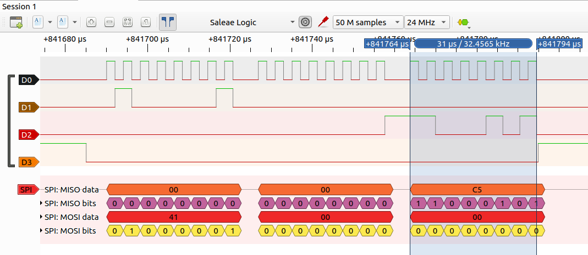

# Communication Protocols

## SPI

Bidirectional.

MCP23S08 example for reading bytes: Send one additional byte.

```
  Opcode       Register 0   Random byte
→ 0b01000001 - 0b00000000 - 0b00000000

  (   IC is listening    )  Result
← 0b00000000 - 0b00000000 - 0b11000101
```


