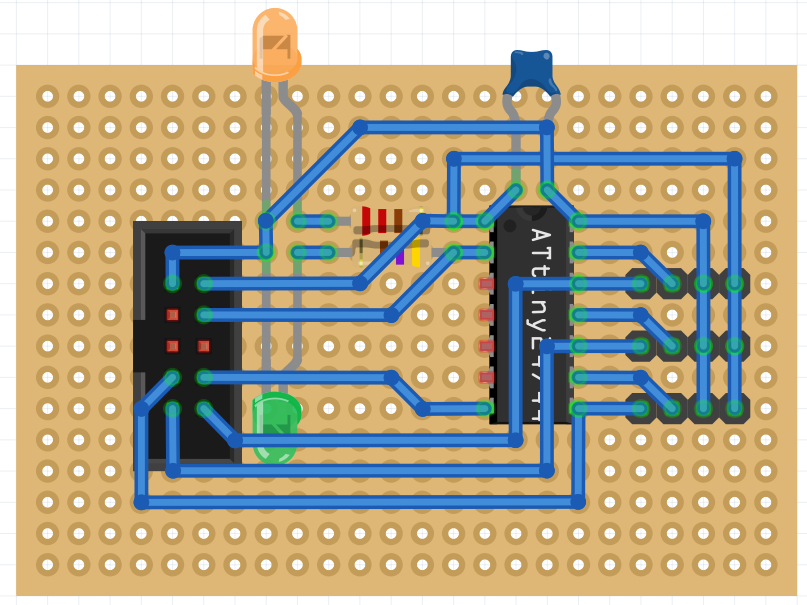

## Design Guidelines

“Productive prototype” experiences:

**Flexible parts** eventually break from usage. Get rid of them if possible.

**Gravity** eventually wins. Plugs which are mounted upside down and which are exposed to vibration eventually disconnect.
Attach them in a different way.

**Status info** e.g. with LEDs is very helpful for debugging on the field. Is the controller broken (signal does not change)
or is the consumer broken (does not react to signal)?

**Metal screw connections** loosen quickly due to vibration when they are attached directly onto metal. Nut and bolt only
hold together due to friction between each other, and friction is caused by the tensile stress from fastening.

Friction between metal and metal is rather low, and to make the connection more secure, it has to be improved. There are
different methods for different applications – they apply to normal bolts and nuts, but also to mechanical/electrical elements
like buttons, switches, and plugs which are often threaded and fastened with a nut. Examples:

* Resinous fluids like Loctite which are applied on the thread and essentially stick between thread and nut
* An additional disc (e.g. plastic) with higher friction; it can also be squeezed together while fastening, preventing vibration
* A second nut, with the first nut being tightened at half torque; see [Wikipedia: Nut](https://en.wikipedia.org/wiki/Nut_(hardware))
* Lock nuts

**Fuses** are only useful if the correct fuse is inserted. Label the housing
with the correct fuse rating (e.g. 1 A or 5 A).

**Plugs** which are used frequently tend to break at the soldering connection.
Filling plugs (e.g. Chinch plugs) with an isolating material like
[Sugru](http://sugru.com/) improves stability and prevents short-circuits when
connections finally break.

Links:

* [Detailed Design for Assembly Guidelines](Datasheets/detailed_dfa_design-for-assembly-guidelines.pdf) ([URL][ddag])
  lists a lot of best practices for design including automation
* [Top 5 PCB Design Guidelines](https://resources.altium.com/pcb-design-blog/top-pcb-design-guidelines-every-pcb-designer-needs-to-know)
* [Practical PCB Layout Tips](https://www.allaboutcircuits.com/technical-articles/practical-pcb-layout-tips/)

[ddag]: http://homepages.cae.wisc.edu/~me349/lecture_notes/detailed_dfa.pdf

## Through-Hole board design guidelines

**Order** of components

* Input on the left, output on the right
* Use technical power direction (VCC on top and GND on the bottom) also for connectors

**Component selection**

* Use appropriate terminals: Pin headers with Dupont for thin wires,
  screw or (preferred) spring terminals for higher currents and AC.

**[Fritzing](http://fritzing.org/)** provides a breadboard designer.

* Make use of GND and VCC symbols in the Schematic view to keep it clean.
  This also helps to re-order pin assignments on input terminals
  because only one GND wire has to be changed instead of many.

## Breadboard

Cutting wires to the correct length. Strip 6 mm of insulation.

