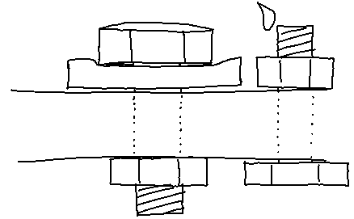
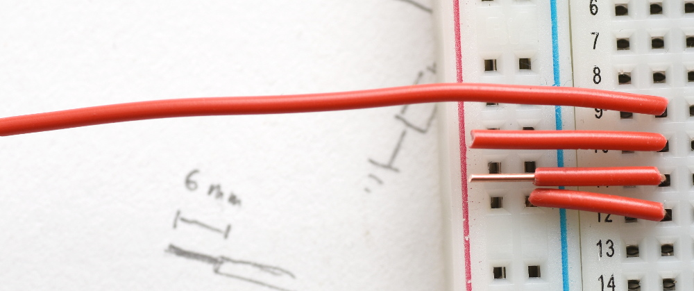

## Design Guidelines

“Productive prototype” experiences:

**Flexible parts** eventually break from usage. Get rid of them if possible.

**Gravity** eventually wins. Plugs which are mounted upside down and which are exposed to vibration eventually disconnect.
Attach them in a different way.

**Status info** e.g. with LEDs is very helpful for debugging on the field. Is the controller broken (signal does not change)
or is the consumer broken (does not react to signal)?

**Metal screw connections** loosen quickly due to vibration when they are attached directly onto metal. Nut and bolt only
hold together due to friction between each other, and friction is caused by the tensile stress from fastening.

Friction between metal and metal is rather low, and to make the connection more secure, it has to be improved. There are
different methods for different applications – they apply to normal bolts and nuts, but also to mechanical/electrical elements
like buttons, switches, and plugs which are often threaded and fastened with a nut. Examples:

* Resinous fluids like Loctite which are applied on the thread and essentially stick between thread and nut
* An additional disc (e.g. plastic) with higher friction; it can also be squeezed together while fastening, preventing vibration
* A second nut, with the first nut being tightened at half torque; see [Wikipedia: Nut](https://en.wikipedia.org/wiki/Nut_(hardware))
* Lock nuts

Links:

* [Detailed Design for Assembly Guidelines](Datasheets/detailed_dfa_design-for-assembly-guidelines.pdf) ([URL][ddag])
  lists a lot of best practices for design including automation

[ddag]: http://homepages.cae.wisc.edu/~me349/lecture_notes/detailed_dfa.pdf

## Breadboard

Cutting wires to the correct length. Strip 6 mm of insulation.

