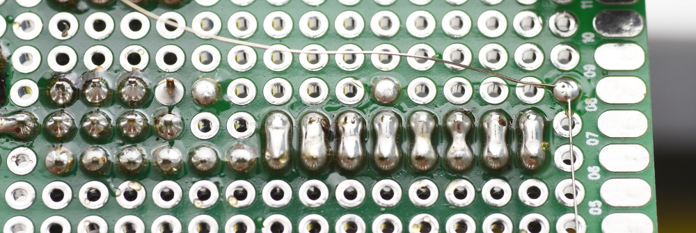
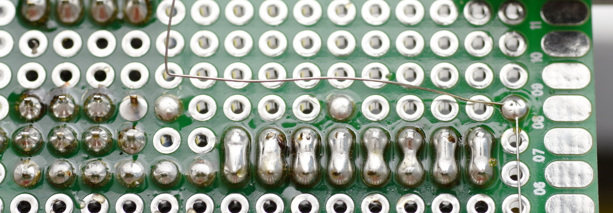
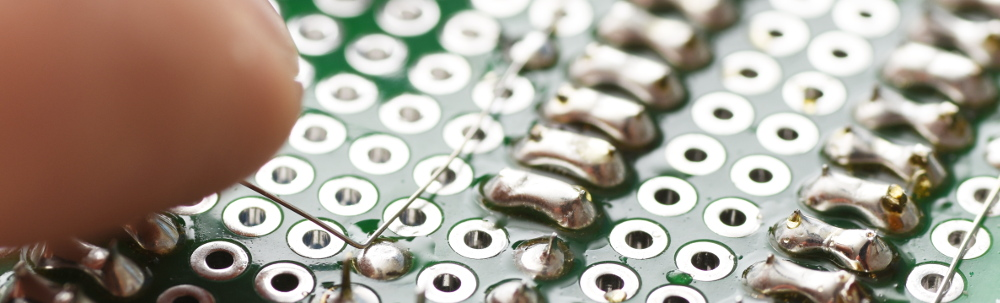
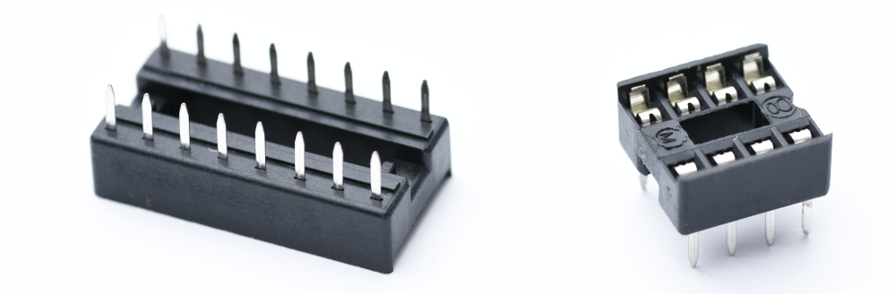
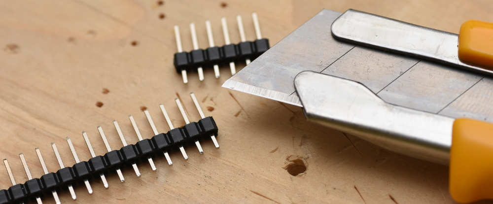

# Soldering

## Soldering howtos

* [Professionelles Löten von Lochrasterplatinen](http://docplayer.org/5770969-Professionelles-loeten-von-lochrasterplatinen.html)
* [ON Semiconductor Soldering and Mounting Techniques Reference Manual][solderrm-d]
* [Common Soldering Problems](https://learn.adafruit.com/adafruit-guide-excellent-soldering/common-problems) in Adafruit’s “Guide to Excellent Soldering”

[solderrm-d]: https://www.onsemi.com/pub/Collateral/SOLDERRM-D.PDF

### Soldering Temperature

The soldering temperature depends on the type of solder (lead free or not, for example) and also
on the size of the object to solder. When the temperature is right, a clean solder takes around 2–3 seconds for through-hole PCBs
and 1–2 s for SMDs.

Use the lowest temperature which allows to solder cleanly. If it takes several seconds to heat legs until the solder melts,
the temperature is too low.

I personally use lead-free solder, which is just as easy to solder with as the old solder with lead. Also, if you
accidentally breathe in the soldering fumes, it better be lead free as lead is quite poisonous.

I solder at 325 °C usually, for pin connectors or for heating solder bridges 335 °C, for soldering even larger Chinch plugs 350 °C
or more (they should also accept the solder within 3 seconds at most), and for removing insulation of coated copper wires 400 °C.

Those numbers *depend on the soldering station* and are only thought as a rough guidance. Soldering stations have
different temperature control, the heat transfer (or, heat loss) to the soldering tip is different, the solders differ, etc.
With a different soldering station, I use 10 °C less for all temperatures above.

## Desoldering

To remove through-hole parts, two things help a lot:

* Add more solder to guarantee good heat transfer from soldering tip to solder,
  so it stays molten
* Use fluxing agent for the same reason and to prevent the soldering tip from
  becoming covered with a burnt layer, which again prevents heat transfer

After removing through-hole parts, use a desoldering pump like the Soldapullt
SS350 by Edsyn to remove remaining solder from the hole.

## Solder

Halogen free solder should be preferred as the salts can lead to corrosion.

## Soldering coated copper wire

Coated copper wire (or magnet wire) is copper wire with a very thin insulation layer. Due to the insulation coating,
wires can cross each other without conducting, which is very useful for slightly more complex PCB wiring.

To solder coated copper wire, the insulation has to be removed. This can be done physically with specialised tools,
but usually the coating burns at a (specified) temperature around 400 °C. Put some solder on the soldering tip, heat it
to 400 °C, and dip the end of the coated copper wire into the hot solder; the coating evaporates.

At lower temperatures, the solder does not stick to the coating.

After removing the coating, solder at normal temperatures (around 330 °C for Pb free solder).

## Connecting with uncoated copper wire

Thin tinned copper wire (31AWG here) is useful for connections over larger distances. It should be soldered every few
holes on the PCB board to avoid that the wire might shifht and touch other contacts.

When creating corners, the free end of the wire should point upwards (or the corner points into the hole). When soldering,
the end is pushed down, which presses the corner onto the hole and allows to get the wire as close as possible to the PCB.

The corner can be created with pliers, but I often use the (narrow) soldering tip directly while I’m soldering as I don’t
have to switch the tools.

## Soldering DIP ICs

From around DIP-6 and above, consider using DIP sockets which are soldered first.
The IC can then be plugged onto the socket. Benefits: it is not heated while soldering,
and it can easily be replaced if broken or removed/salvaged if not required anymore.

DIP sockets can be soldered next to each other, and ICs can span multiple sockets without a problem, so if you do not
have the correct size, combine some sockets and you are fine.

## Joining two wires

[NASA lists four different solder splices][nasa-splices] used to join two or more wires reliably:

* Lap splice
* Hook splice
* Lash splice
* Western Union splice; on YouTube: [How To Splice Wires to NASA Standards](https://www.youtube.com/watch?v=O-ymw7d_nYo)

[nasa-splices]: https://web.archive.org/web/20090731171918/http://workmanship.nasa.gov/guidadv_recmeth.jsp

## Pin Headers

Pin headers usually come in rows of 50 pins. They need to be cut properly to avoid breaking off parts at the wrong place.
A side cutter unfortunately does not cut it (ha ha pun) as it is too wide. Cutting pin headers with a cutter on a wooden
board works quite good; start cutting from one side, then flip it and cut it through from the other side.

## MOSFETs

Larger MOSFETs have a hole in their heatsink which allows them to be mounted onto an even larger heatsink.
ON Semi provides a in-depth [manual on soldering MOSFETs][onsemi-mosfet],
and Vishay has [guidelines on handling failed MOSFETs][vishay-mosfet].

[onsemi-mosfet]: https://www.onsemi.com/pub/Collateral/SOLDERRM-D.PDF
[vishay-mosfet]: http://www.vishay.com/docs/71436/an839.pdf

## Kapton

The transparent orange tape used for soldering, often seen on electronics like
laptop or mobile phone boards or around accumulators. Kapton is a trade name
by DuPont, it is a Polyimid film with 303 kV/mm dielectric strength (very high)
and good chemical and temperature resistance (260 °C, 315 °C for a short duration).

## Cleaning PCBs

* [Wie reinigt ihr Platinen?](https://www.mikrocontroller.net/topic/267544)

## Soldering Connectors

### Chinch connectors

* [How to Solder: An Illustrated DIY Guide to Making Your Own Audio Cables](http://www.hometheatershack.com/forums/remotes-cables-accessories-tweaks/13000-how-solder-illustrated-diy-guide-making-your-own-cables.html)
